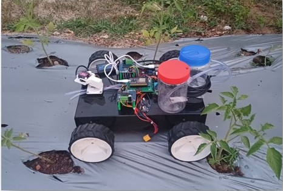
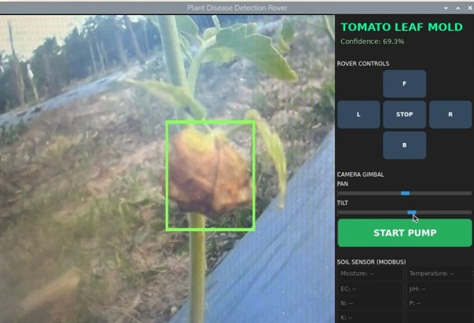

# Smart Agriculture Robot for Plant Disease Prediction

A final year B.Tech project from the Department of Electrical and Electronics Engineering, MBCET. An autonomous rover that detects tomato leaf diseases in real time using a MobileNetV2 deep learning model deployed on a Raspberry Pi, with integrated soil sensing, targeted spraying, and a live control dashboard.

**Paper accepted at ICTEST 2026** — International Conference on Smart Communication and Sustainable Technologies, Saintgits College of Engineering, Kottayam (June 2026). Paper ID: 1248.

---

## Demo





---

## What the system does

The rover navigates autonomously through a crop field. As it moves, a USB camera captures live video of plant leaves. Each frame is analysed by a CNN model running on the Raspberry Pi. If a tomato leaf disease is detected above a 60% confidence threshold, the system draws a bounding box around the leaf and activates a targeted spray pump. Simultaneously, a soil sensor tracks moisture, temperature, EC, pH, and NPK levels — triggering irrigation if moisture drops below 35%, or fertiliser spray if nutrient levels fall below recommended ranges.

Everything is controlled through a PyQt6 GUI dashboard showing the live feed, detection results, confidence scores, soil readings, and manual rover/gimbal controls.

---

## System Architecture

```
┌─────────────────────────────────────────────────────┐
│                    RASPBERRY PI                      │
│                                                      │
│   Camera Thread  →  Inference Thread  →  Display    │
│   (OpenCV)          (MobileNetV2         Thread     │
│                      TFLite)             (PyQt6)    │
│                            │                         │
│                     Serial Thread                    │
│                     (PySerial)                       │
└────────────────────────────┬─────────────────────────┘
                             │ USB Serial (115200 baud)
                             ▼
                   ┌──────────────────┐
                   │      ESP32       │
                   │  BTS7960 Motor   │
                   │  Driver          │
                   │  Pan-Tilt Servo  │
                   │  Dual Relay      │
                   │  (Pump Control)  │
                   │  Soil Sensor     │
                   └──────────────────┘
```

---

## Key Features

- Real-time disease classification at approximately 30 FPS on Raspberry Pi
- MobileNetV2 trained on PlantVillage dataset — 38 disease classes across 14 crops
- Tomato-specific filter with 60% confidence threshold to reduce false positives
- HSV-based green masking for leaf localisation and bounding box generation
- Autonomous pan-tilt sweep (60°–120°) for wider field coverage
- Auto-pump trigger with 3-second spray duration and 10-second cooldown
- Soil sensor integration (Moisture, Temperature, EC, pH, N, P, K via Modbus)
- Multi-threaded architecture using Python Queues — no frame drops or lag
- Full PyQt6 GUI with manual override controls for movement and gimbal

---

## Model Details

| Property        | Value                        |
|-----------------|------------------------------|
| Architecture    | MobileNetV2                  |
| Format          | TensorFlow Lite (.tflite)    |
| Input size      | 224 × 224 × 3                |
| Output          | 38-class softmax             |
| Dataset         | PlantVillage + IIHR dataset  |
| Training images | 1,958 (IIHR) + PlantVillage  |
| Threshold       | 0.6 (60% confidence)         |

Dataset was sourced from the Indian Institute of Horticultural Research (IIHR) with support from Dr. Sandeep Kumar, facilitated through CTCRI by Dr. Santhosh Mithra.

### Tomato diseases detected

Bacterial Spot · Early Blight · Late Blight · Leaf Mold · Septoria Leaf Spot · Spider Mites (Two-spotted) · Target Spot · Yellow Leaf Curl Virus · Mosaic Virus · Healthy

---

## Repository Structure

```
smart-agri-rover/
│
├── testmain2.py                  # Main file — full PyQt6 GUI with all features
├── testmain.py                   # Headless version — multithreaded, no GUI
├── testmain1.py                  # Headless + HSV bounding box detection
├── plantDiseaseTest1.py          # v1 — basic inference loop
├── plantDiseaseTest2.py          # v2 — confidence threshold + tomato filter
├── plantDiseaseTest2Serial.py    # v3 — ESP32 serial + multithreading added
├── serialTest.py                 # Serial communication test script
├── CamTest.py                    # Camera feed test script
├── labels.txt                    # 38 disease class labels
├── requirements.txt              # Python dependencies
└── README.md
```

---

## Hardware Components

| Component                  | Purpose                                               |
|----------------------------|-------------------------------------------------------|
| Raspberry Pi 4             | AI compute — runs Python, TFLite inference            |
| ESP32 Microcontroller      | Motor control, servo control, relay actuation         |
| USB Camera                 | Live video capture for disease detection              |
| BTS7960 Motor Driver       | High-current H-bridge for DC geared motors (up to 43A)|
| Pan-Tilt Servo Gimbal      | Camera scanning across 60°–120° horizontal range      |
| LiPo Battery (2200 mAh)    | Main power source — high discharge for motors         |
| LM2596 DC-DC Buck Converter| Regulated voltage to Raspberry Pi and sensors         |
| Dual-Channel Relay Module  | Independent control of water and fertiliser pumps     |
| DC Pump Motors (×2)        | Targeted water and fertiliser spraying                |
| 5-Pin Soil Sensor (Modbus) | Reads Moisture, Temperature, EC, pH, N, P, K          |

---

## Decision Logic

```
Disease detected (confidence > 60%)  →  Activate spray pump (3s)
Soil moisture < 35%                   →  Activate irrigation pump
Nitrogen < 40 mg/kg                   →  Trigger fertiliser spray
Phosphorus < 30 mg/kg                 →  Trigger fertiliser spray
Potassium < 60 mg/kg                  →  Trigger fertiliser spray
Plant healthy + soil normal           →  No action
```

A 10-second cooldown prevents repeated or excessive spraying after each activation.

---

## Results

| Test                          | Result                                |
|-------------------------------|---------------------------------------|
| Tomato Leaf Mold detection    | Detected — 69.3% confidence           |
| Yellow Leaf Curl Virus        | Detected — 64.5% confidence           |
| Field testing location        | Naadan Agro Farms (guided by Mr. Sujith S V) |
| Edge deployment               | Raspberry Pi — real-time at ~30 FPS   |

---

## Software Architecture — Multithreading

Four parallel threads communicate via Python Queues, coordinated by a shared `threading.Event` for clean shutdown:

- **Camera Thread** — captures frames continuously using OpenCV VideoCapture; drops oldest frame if queue is full
- **Inference Thread** — preprocesses frames, runs TFLite interpreter, outputs label, confidence, and bounding box
- **Display Thread** — renders annotated frames on PyQt6 GUI, handles user input
- **Serial Thread** — sends movement/servo/pump commands to ESP32; parses incoming soil sensor data

---

## Development Progression

The codebase shows iterative development across six stages:

1. Basic camera feed with model inference — `plantDiseaseTest1.py`
2. Confidence thresholding and tomato-specific filtering — `plantDiseaseTest2.py`
3. ESP32 serial integration and rover movement — `plantDiseaseTest2Serial.py`
4. Production-grade multithreaded architecture with Queue communication — `testmain.py`
5. HSV-based bounding box detection around the leaf region — `testmain1.py`
6. Full PyQt6 GUI with soil sensor panel, auto-pump, and gimbal sliders — `testmain2.py`

---

## Future Scope

- Autonomous path planning with obstacle avoidance
- Multi-crop disease detection beyond tomato
- IoT cloud monitoring and remote dashboard
- Weather data integration for predictive outbreak alerts
- Precision nozzle control for targeted micro-spraying

---


## Acknowledgements

- [PlantVillage Dataset](https://github.com/spMohanty/PlantVillage-Dataset)
- Indian Institute of Horticultural Research (IIHR) — dataset support (Dr. Sandeep Kumar)
- Central Tuber Crops Research Institute (CTCRI) — facilitated by Dr. Santhosh Mithra
- Naadan Agro Farms — field testing (Mr. Sujith S V)
- [TensorFlow Lite](https://www.tensorflow.org/lite)
- [MobileNetV2 paper](https://arxiv.org/abs/1801.04381) — Sandler et al., Google, 2018
